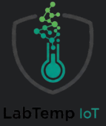

# LabTemp IOT

<h1>DESCRIÇÃO:</h1>    
O projeto tem como objetivo fazer um aplicativo multiplataforma(tendo uso tanto em computadores quanto sendo um mobile instalável), para o acompanhamento 
de monitoração de temperaturas em estufas. 

## ⚙️ TECNOLOGIAS USADAS

| Tecnologia       | Emoji  |
|------------------|--------|
| React Native     | 📱     |
| Node.js          | 🖥️     |
| Figma            | 🎨     |
| Trello           | 📋     |
| Visual Studio    | 💻     |
| GitHub           | 🧑‍💻     |
| PostgreSQL       | 🗃️     |
| ESP32            | ⚙️     |
| C++              | 🖥️     |
| Docker           | 🐳     |
---

# 🗂️ SPRINTS
| Sprint | Data de Início | Data de Entrega | Status  |
|--------|----------------|-----------------|---------|
|  1     | :calendar: ➡ (16/09/2025) | 📆 ➡ (02/10/2025) |  Em Andamento |
|  2     | :calendar: ➡ (13/10/2025) | 📆 ➡ (31/10/2025) |  Em Andamento |
|  3     | :calendar: ➡ (06/11/2025) | 📆 ➡ (24/11/2025) |  Em Andamento |

---

# 📌 Backlog do Produto
---
# Funcionais
|     Requisitos Funcionais     |    Situação  |
|-------------------------------|--------------|
|Coletas de dados               | Em andamento | 
|Uso em dispositivos Mobile     | Em andamento |
|Represetação apartir de gráficos| Em andamento |
|Envio de avisos                | Em andamento |
---
# Não Funcionais
|  Requisitos Não Funcionais    |  Situação    |   
|-------------------------------|--------------| 
|Linguagem Node.JS              |              |
|Programação em React Native,   |              |
|C++ e Docker                   |              |
|Bando de dados relacional      |              |
|(PostgreeSql)                  |              |
|Arduino                        |              |

-----------------------------------------------------------------------------------

# 🔗 LINKS

### 🧮 TRELLO 
[Clique Aqui]()

### 📖 REQUISITOS DO CLIENTE
[Clique Aqui]()

### 🎨 FIGMA
<a target="_blank" href="https://www.figma.com/design/y0pcSNOmPBO2klzKAnKfZT/Untitled?node-id=0-1&p=f&t=GzqOL1SNGfxnOhwj-0">[Clique aqui]</a>

# :computer: EQUIPE

|CARGO | NOME| SOCIAL MEDIA |
|------|-----|:--------------:|
| S.M (Scrum Master) |   André Ventura   |     |
| P.O (Product Owner)     |   Andre Michel   |     | 
| Dev     |   Bruno Henrique   |     |  
| Dev     |   Eduardo Henrique  |     |  
| Dev     |   Valcir  |     |     
| Dev     |   Rodrigo   |     |  
